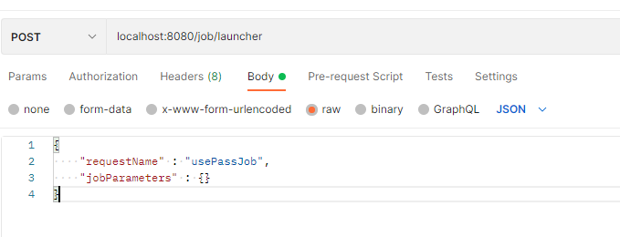

# SpringBatch

## 😃 이용권 프로젝트 소개
JAVA Spring기반 이용권 관련 WAS 구현

## ✏ 프로젝트 목적
- 스프링 배치를 학습하여 실무에 적용해보기

## ⚙️ 개발 환경
- Java 17
- JDK 17
- IDE : IntelliJ
- Framework : Springboot(3.1.8)
- Database : Mysql(Docker 기반)
- ORM : JPA(Spring Data JPA, QueryDSL)

## 💾 데이터 베이스 관련(필수)
**`WAS를 실행시키기 위해 DB가 먼저 구축 되어야합니다.`  **
- 1. docker-compose 를 설치하여야 합니다.(추천 : 도커 데스크톱 설치)
- 2. cmd창을 열어서 docker-compose.yml 파일이 있는 위치로 이동 (web/db/docker-compose.yml)
- 3. 해당 경로의 cmd창에서 하기의 명령어 입력  
**`docker-compose up -d`  **

## 📌 주요 기능
**`테스트 코드를 통해 기능을 확인하시면 편합니다.`  **
- 이용권 만료 (expirePassJob) 
- 이용권 지급 (addPassJob)
	
### [참고] 이용권 관련 API
- 모든 API는 localhost:8080/job/launcher url을 통해 호출되며, JSON 형식의 request에 requestName, jobParameters 를 통해 제어합니다.   

  

	
